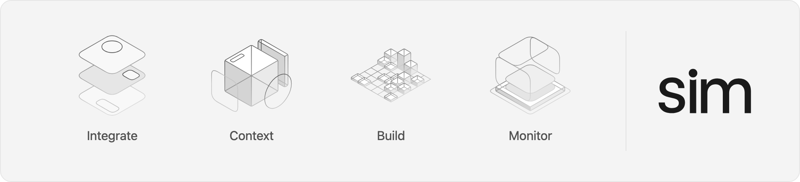
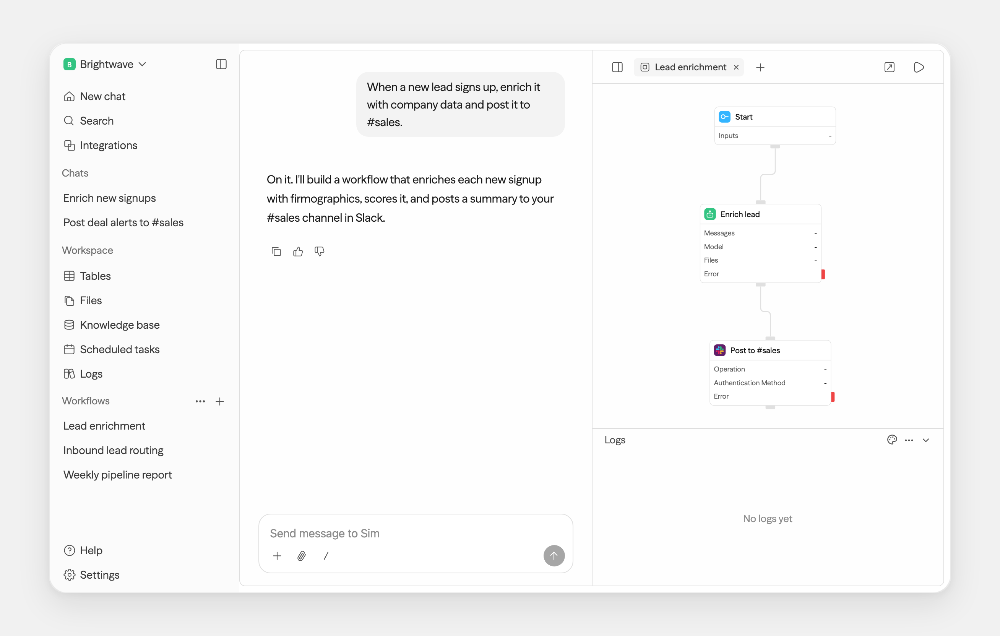
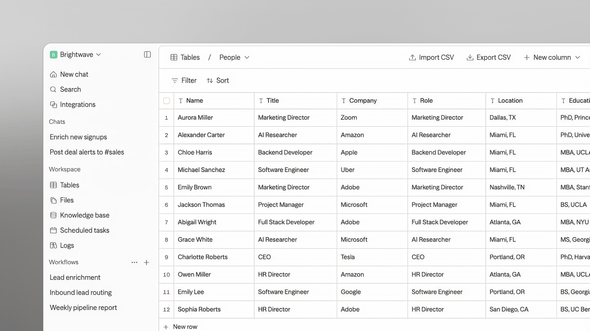
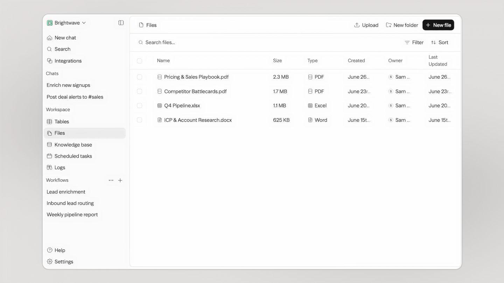
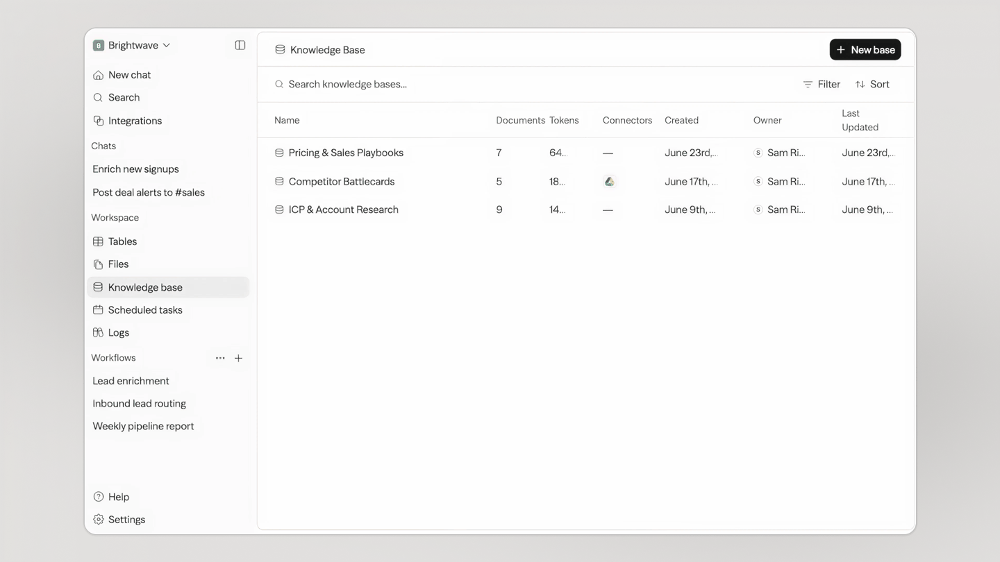

<p align="center">
  <a href="https://sim.ai" target="_blank" rel="noopener noreferrer"></a>
  <a href="https://docs.sim.ai" target="_blank" rel="noopener noreferrer"></a>
  <a href="https://join.slack.com/t/sim-ott9864/shared_invite/zt-43lp8tc5v-0qrrqHGBKUsvQlpoouH~TA" target="_blank" rel="noopener noreferrer"></a>
  <a href="https://x.com/simdotai" target="_blank" rel="noopener noreferrer"></a>
</p>

<p align="center">
  <a href="https://deepwiki.com/simstudioai/sim" target="_blank" rel="noopener noreferrer"></a>
</p>

<p align="center">
  <a href="https://sim.ai" target="_blank" rel="noopener noreferrer">
    
  </a>
</p>

<p align="center">LingxiLearn 的 Sim 前端工作区：为课程任务提供对话、工具调用、思考摘要与产物展示。</p>

## Quickstart

### Cloud-hosted: [sim.ai](https://sim.ai)

<a href="https://sim.ai" target="_blank" rel="noopener noreferrer"></a>

### Local development

```bash
docker compose -f ../docker-compose.dev.yml up --build
```

从仓库根目录执行：

```bash
docker compose -f docker-compose.dev.yml up --build
```

前端源码通过 bind mount 加载，访问 [http://localhost:3000](http://localhost:3000)；API 在 [http://localhost:8080](http://localhost:8080)。

<p align="center">
  
</p>

## Capabilities

- Connect 1,000+ integrations and every major LLM
- Add Slack, Notion, HubSpot, Salesforce, databases, and more
- Build agents visually, conversationally, or with code
- Ingest files, knowledge bases, and structured table data
- Monitor runs, logs, schedules, and workflow activity

## One workspace, every surface

<p align="center">Chat and workflows are just the start — tables, files, and knowledge all live in the same workspace.</p>

<table>
  <tr>
    <td width="50%" valign="top">
      
      <p align="center"><b>Tables</b> — a database, built in</p>
    </td>
    <td width="50%" valign="top">
      
      <p align="center"><b>Files</b> — one store for your team and every agent</p>
    </td>
  </tr>
  <tr>
    <td width="50%" valign="top">
      
      <p align="center"><b>Knowledge</b> — your agents' memory</p>
    </td>
    <td width="50%" valign="top"></td>
  </tr>
</table>

## Deployment

根目录只保留两套 Compose。

```bash
# 本地开发：源码 bind mount，前端 3000，API 8080
docker compose -f docker-compose.dev.yml up --build

# 生产：静态前端构建产物由 API 单进程提供
docker compose up --build
```

生产路径只启动 Postgres、一次性迁移、静态前端构建和一个 FastAPI API 实例；LingxiGraph 的任务更新使用 REST/SSE，不需要 Realtime、Redis 或 Cron 容器。

## Chat API Keys

LingxiLearn 使用 LingxiIdentity 与 LingxiGraph API，不再依赖 Sim 自带的 Chat API Key 管理器。

## Environment Variables

See the [environment variables reference](https://docs.sim.ai/self-hosting/environment-variables) for the full list, or [`apps/sim/.env.example`](apps/sim/.env.example) for defaults.

## Tech Stack

<details>
<summary>Next.js · Bun · PostgreSQL · Drizzle · Better Auth · Tailwind — and the rest of the stack</summary>

- **Framework**: [Next.js](https://nextjs.org/) (App Router)
- **Runtime**: [Bun](https://bun.sh/)
- **Database**: PostgreSQL with [Drizzle ORM](https://orm.drizzle.team)
- **Authentication**: [Better Auth](https://better-auth.com)
- **Schema Validation**: [Zod](https://zod.dev)
- **UI**: [Shadcn](https://ui.shadcn.com/), [Tailwind CSS](https://tailwindcss.com)
- **Streaming Markdown**: [Streamdown](https://github.com/vercel/streamdown)
- **State Management**: [Zustand](https://zustand-demo.pmnd.rs/), [TanStack Query](https://tanstack.com/query)
- **Flow Editor**: [ReactFlow](https://reactflow.dev/)
- **Docs**: [Fumadocs](https://fumadocs.vercel.app/)
- **Monorepo**: [Turborepo](https://turborepo.org/)
- **Task streaming**: REST + Server-Sent Events (SSE)
- **Remote Code Execution**: [E2B](https://www.e2b.dev/)
- **Isolated Code Execution**: [isolated-vm](https://github.com/laverdet/isolated-vm)

</details>

## Contributing

We welcome contributions! Please see our [Contributing Guide](.github/CONTRIBUTING.md) for details.

## License

This project is licensed under the Apache License 2.0 - see the [LICENSE](LICENSE) file for details.

<p align="center">
  
</p>
